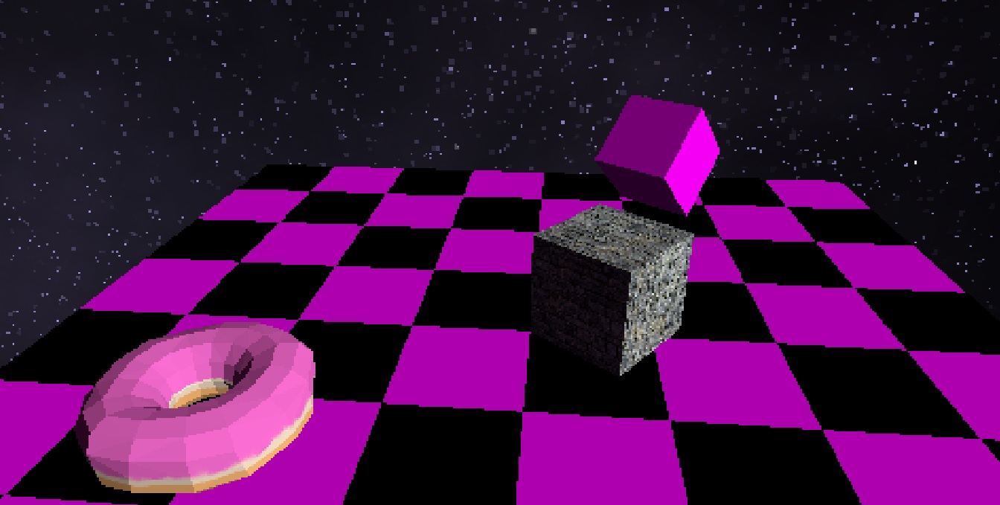

# WGPU Rendering

Some 3d rendering with wgpu-rs. This was tested and ran with the Vulkan backend in mind, so issues may be encountered with the other backends

## Features

- cubemaps / skyboxes
- Obj and glTF loading
- Resolution scaling
- Scene loading
- Basic Lighting

## TODO's

- Animation support
- UI and Text rendering